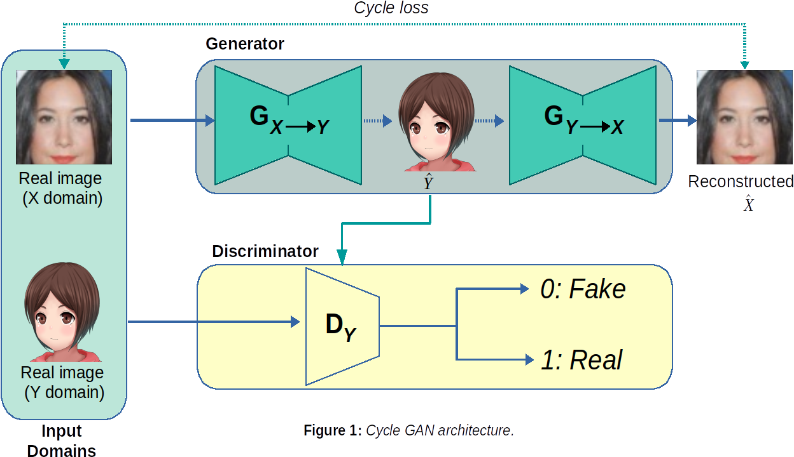
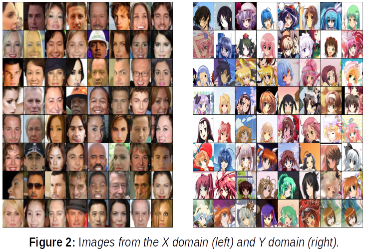
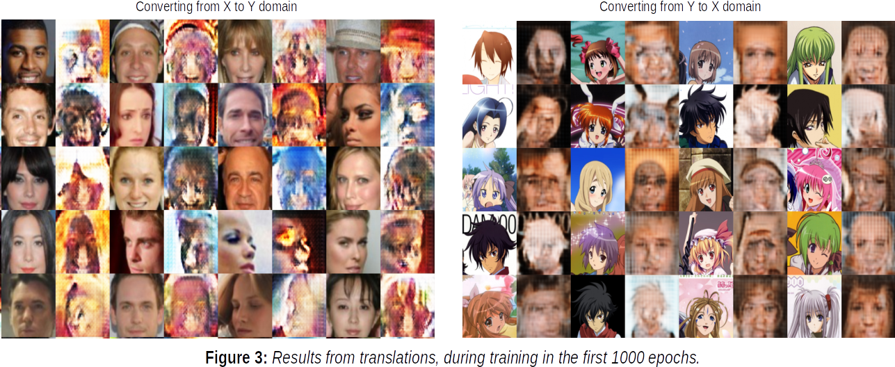
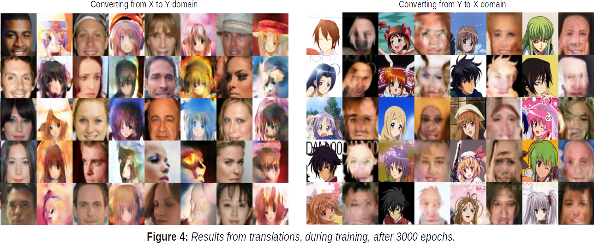
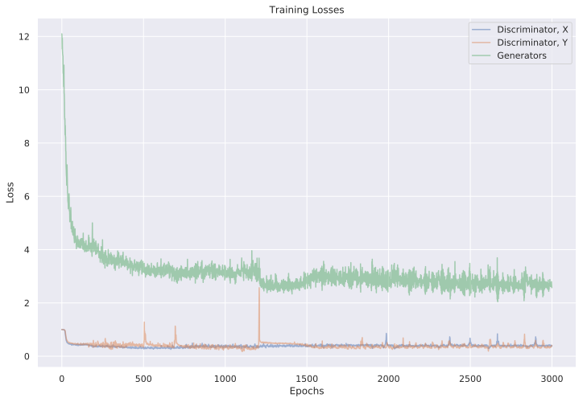

# Cycle GAN Face Transformation

## Introduction
Cycle GANS are a special variation of GANs, which main objective focuses on the translation from one domain to another. For example, one can consider a set of images from a winter season in contrast with a summer ones. In this case, the domains are represented by the intrinsic characteristics of each type of image: winter vs summer, where each one have unique features: light intensity, sky color, snow, etc.; which differentiate them.

As such, a CycleGAN allow us to transform (translate) from one domain X to another Y. In order to achieve this translation, CycleGAN add more components over the vanilla GAN. Among them, we have the cycle loss, which assures the consistency when translation from one domain to another. Also, since we want to learn to map from two different domains, a pair of two generators (_Gx_, _Gy_) and discriminators (_Dx_, _Dy_) are been used. This in contrast with a GAN model, which usually have only one generator and discriminator.

In this repository a CycleGAN was implemented to translate from human faces to cartoon ones, and vise versa. The project was developed mainly in pytorch.

## Model Architecture
The model is composed by a Cycle GAN, where two generators (_Gx_ and _Gy_) learn to map images between the X and Y domains respectively. Also, two discriminators (_Dx_ and _Dy_) are used.  __Figure 1__, depicts the general architecture used to translate from one domain into another. In this case, we can see how an image from the X domain is translated into the Y domain. In this process we obtain a fake Y image, which is used in the Dy discriminator, alongside a real Y image. We also want to translate this fake Y image into an image from the X domain. This is achieved thanks to the implementation of a cycle loss. This assures consistence between translations, allowing the generator Gx to learn to effectively map to the Y domain. This process is applied also for images in the Y domain, with the roles inverted.



Individually, each generator is composed by: three convolutional blocks, which act as an encoder, ten residual blocks, which contain the learning features, and three transpose convolutional layers, which act as a decoder. Meanwhile, the discriminators are composed by: five convolutional layers, where the last convolution layer outputs a one vector, which allows the discriminator to detect the fake from the real images.

## Data sets
Also, the data sets used correspond to faces from the celebrities (celebA) and cartoons (anime) data sets. However, these data sets had been modified. For example, in the celebA, the images were resized to 64 x 64. Also, from both data sets, a random subset has been taken. This correspond to 3,188 images for the celebA data set and 3,283 for the anime data set. In the __Figure 2__ we can see the some images corresponding to each data set. Here, the X domain represent the human faces and the Y domain, the cartoon ones.



## Training Results:
The model was trained for 3000 epochs. During each epoch, the best model was selected, using as metric the accumulated losses from the generators. As we can see in the __Figure 3__, in the first 1000 iterations the model was gradually learning to map between the X and Y domains. 



Meanwhile, as we can appreciate in __Figure 4__; after 3000 epochs, the generators created more distinguish features between mappings.



Also, in the __Figure 5__, we can observe how the losses were evolving during the training process. As expected from this type of models, the losses have some variations. For example, at the 1200 iteration, the generators drastically decrease their losses, meanwhile the Dy discriminator increase. Also, this plot suggest that more iterations would result in no improving for the generators. This was empirically checked with more experiments, were more iterations were added. However, this not improved the quality of the generated images by _Gx_ or _Gy_.


__Figure 5:__ _CycleGAN training losses._

## Installation
This project was developed in Ubuntu 19.04, therefore it is most likely to be compatible with other Ubuntu versions such as: 16.04 +. If you use other OS, you could need to adjust some configurations. First, download or clone this repository. Then create a virtual environment. You can use python native environment manager or conda environments. Once you created the environment, make sure to install the following dependencies:
* torchvision==0.2.2
* pytorch-cpu=1.1.0 (if you have a GPU, then install the GPU version)
* numpy==1.16.2
* Pillow==5.4.1
* matplotlib=3.0.3
* python=3.7.2

Next, you need to download the trained model. You can download them from __here__. Make sure to put this file inside the /model/ folder.

## Running
To run the project, make sure to have the images you want to convert in the images/inputs folder. This repository include some images you can use. If you use your own images, make sure to select the face areas. Also, you need to input an image with a single face. For better results, I suggest to resize the human faces to 64 x 64. This step is not necessary for the cartoon images. You can use jpg and png images.
Now, assuming you have two images, for example: __human.jpg__ and __cartoon.png__; you can convert them from the terminal with the following commands:

```
python main.py -i 'human .png' -c 'cartoon' | To convert the human face into a cartoon one.
```
or,
```
python main.py -i ' cartoon.jpg' -c 'human' | To convert the cartoon face into a human one.
```

Alternatively, you can specify the names of the generated images with the -f command. For example:
```
python main.py -i 'human .png' -c 'cartoon' -f ‘image_result’ | This will save the results as  image_comparison.svg and image_result.svg
```

Finally, you can access the command list using __python main.py -h__. A more detailed description about the commands is shown here:

* -i: This represent the image name, for example: ‘my_image.png’. Note that this image must be in the images/inputs folder.

* -c: This represent the type of conversion. The allowed values are: ‘human’ and ‘cartoon’.

* -f: Name of the result images. If you ignore this parameter, the resulting images will have the names: image_comparison and image_result as default. The images will be saved in the images/outputs folder.
